<div align="center">
  <picture>
    <source media="(prefers-color-scheme: dark)" srcset="web/public/brand/forge-wordmark-light.svg">
    
  </picture>

  <p><strong>Many specialists. One coordinated system.</strong></p>
  <p>A local-first control plane for planning, executing, verifying, and governing AI coding work.</p>

  <p>
    
    
    
    
    
    
  </p>

  <p>
    <a href="#quick-start">Quick start</a> ·
    <a href="#what-forge-does-today">Capabilities</a> ·
    <a href="#visual-tour">Visual tour</a> ·
    <a href="docs/near-term-roadmap.md">Near-term roadmap</a> ·
    <a href="docs/wiki.md">Wiki</a>
  </p>
</div>

<p align="center">
  
</p>

## About

FORGE is a browser-based control room for AI-assisted software delivery. It
connects projects, providers, coding agents, durable work packages, bounded
execution, evidence, approvals, and GitHub workflows in one operator-controlled
system.

The product goal is not “give a chatbot shell access.” FORGE separates model
judgement from deterministic execution:

```text
Human intent
  -> Architect plan
  -> durable work packages
  -> capability and Model Context Protocol (MCP) admission
  -> bounded context
  -> sandboxed specialist execution
  -> quality assurance (QA) / Reviewer / Security gates
  -> evidence, recovery, and GitHub handoff
```

FORGE is currently a **single-operator beta**. It can plan and execute approved
specialist packages, apply guarded local repository changes, and preserve the
evidence needed for review. It deliberately stops short of general autonomous
commits, merges, broad live MCP authority, or unrestricted host control.

## Why FORGE

| Principle | What it means in practice |
|---|---|
| **Human authority** | Plans, risky capabilities, review gates, and final outcomes remain inspectable and controllable. |
| **Deterministic boundaries** | Models produce structured plans and requests; FORGE validates scope, policy, commands, files, and outcomes. |
| **Bounded context** | Specialists receive the minimum relevant repository evidence rather than unrestricted filesystem access. |
| **Durable evidence** | Tasks, attempts, work packages, runs, artifacts, approvals, and blocked reasons survive beyond a chat session. |
| **Runtime-neutral agents** | Direct model APIs, local models, Codex CLI, and Claude Code can sit behind consistent FORGE contracts. |
| **GitHub-native delivery** | Structured issues, controlled handoffs, pull request (PR) contracts, and acceptance-criteria checks keep implementation traceable. |

## What FORGE Does Today

### Plan and coordinate

- Create local or GitHub-backed projects.
- Configure cloud, local, and Agent Client Protocol (ACP)-backed providers.
- Ask the Architect to produce an implementation plan.
- Materialize plans into durable work packages, dependencies, capabilities, and review gates.
- Revise, approve, reject, retry, stop, and recover work from the dashboard.

### Execute within policy

- Queue work through Redis and persist orchestration truth in PostgreSQL.
- Execute eligible specialist packages sequentially.
- Build bounded repository context packets.
- Write generated output into per-attempt sandboxes under `.forge/task-runs`.
- Apply validated repository-affecting files through guarded local-write policy.
- Enforce command, file-count, byte, timeout, validation, and retry limits.
- Broker MCP requirements through explicit admission and approval state.

### Review and preserve evidence

- Store plans, execution output, command results, repository evidence, findings, and rework history as artifacts.
- Require QA and Reviewer gates, with Security gates for higher-risk work.
- Keep structured task attempts and blocked/recovery reasons.
- Validate GitHub issues before agent work.
- Generate controlled Claude Code or Codex handoff packages.
- Check pull requests against linked issue acceptance criteria.

## How A Task Flows

```text
Create task
  -> Redis wakes the worker
  -> Architect plans
  -> FORGE materializes packages and gates
  -> operator reviews the plan
  -> capability/MCP admission runs
  -> specialist executes in a bounded attempt sandbox
  -> validated output may be applied to the local project
  -> QA / Reviewer / Security evidence is collected
  -> operator accepts, requests rework, or stops
```

The web app is the control plane. PostgreSQL stores durable state. Redis carries
wake-up, retry, and dead-letter transport. The worker performs planning,
handoff, execution, recovery, and evidence capture.

## Quick Start

From the repository root:

```bash
bash scripts/install.sh
```

The installer prepares local services, creates
`~/Documents/Forge/config/forge.env`, installs web dependencies, prepares the
database, and can configure a small local Ollama model.

Useful variants:

```bash
bash scripts/install.sh --check      # inspect readiness without changing the machine
forge upgrade                        # sync dependencies and migrations after pulling updates
FORGE_SKIP_OLLAMA=1 bash scripts/install.sh
```

Start FORGE:

```bash
forge
```

Open:

```text
http://localhost:3000
```

The first account creates a password and, by default, a passkey. To use password
only, set `FORGE_PASSKEYS_ENABLED=0` in
`~/Documents/Forge/config/forge.env` before creating the first account.

For a no-cost plumbing test, run with the mock Architect:

```bash
cd web
FORGE_WORKER_MOCK_ARCHITECT=1 npm run dev
```

## Try A Task

1. Open the dashboard.
2. Apply a provider preset or add a provider manually.
3. Create a project from a GitHub repository or local folder.
4. Create a focused task with testable acceptance criteria.
5. Wait for the Architect plan and work-package preview.
6. Review capability/MCP requirements and approve or revise the plan.
7. Inspect execution evidence, generated files, commands, and review gates.
8. Accept the result, request rework, or fix a blocked condition and retry.

## Safety Model

FORGE is designed around explicit ceilings rather than presumed agent trust:

- project paths are validated before execution;
- context packets are bounded and inspectable;
- generated files are size/count limited and path checked;
- supported validation commands are allowlisted;
- MCP proposals, approvals, and effective grants are separate states;
- secrets are stored as encrypted settings or environment-variable names;
- prompts, logs, and evidence use redaction and bounded output;
- higher-risk work requires Security review;
- ACP adapters remain local processes and are not presented as OS confinement;
- final authority remains with the operator.

The next deterministic-execution foundation is
[#201 — Operation Catalog and typed execution harness](https://github.com/Joncallim/Forge/issues/201):
agents select approved typed operations, while FORGE constructs, executes, and
verifies the actual action.

## Current Boundaries

Not built or intentionally deferred:

- broad live MCP tool/credential grants for specialists;
- general automatic branch, commit, PR, merge, or deployment authority;
- parallel specialist execution;
- fully autonomous QA, Reviewer, or Security gates;
- arbitrary model-authored shell execution;
- earned autonomy without verified historical evidence;
- the full dockable Forge Workspace shell and link graph.

Current execution paths can be disabled with explicit flags including:

```text
FORGE_WORKFORCE_MATERIALIZATION=0
FORGE_WORK_PACKAGE_HANDOFF=0
FORGE_WORK_PACKAGE_EXECUTION=0
FORGE_HOST_REPOSITORY_WRITES=0
FORGE_ACP_WORK_PACKAGE_EXECUTION=0
```

## Roadmap

The near-term order is deliberately reliability-first:

1. finish and prove MCP admission under Epic #172;
2. run focused end-to-end and failure testing;
3. close observed safety, recovery, and operator-blocking bugs;
4. add the deterministic Operation Catalog in #201;
5. normalize execution outcomes and stop reasons in #185;
6. continue the reliability and earned-autonomy work in Epic #184;
7. resume broad Forge Workspace expansion after the trust layer is proven.

See the [near-term execution roadmap](docs/near-term-roadmap.md) for exit criteria
and the broader [product roadmap](docs/roadmap.md) for the long-form direction.

## Visual Tour

<table>
  <tr>
    <td width="50%">
      <strong>Setup and provider configuration</strong><br><br>
      
    </td>
    <td width="50%">
      <strong>Provider readiness</strong><br><br>
      
    </td>
  </tr>
  <tr>
    <td width="50%">
      <strong>Architect plan and approval</strong><br><br>
      
    </td>
    <td width="50%">
      <strong>Completed orchestration evidence</strong><br><br>
      
    </td>
  </tr>
</table>

## Core Vocabulary

| Term | Plain-English meaning |
|---|---|
| Dashboard | The browser UI where projects, providers, tasks, approvals, and evidence are managed. |
| Project | A local or GitHub-backed repository FORGE can reason about. |
| Task | A user objective submitted to FORGE. |
| Architect | The planning agent that turns intent into a bounded plan and work packages. |
| Work package | A durable, scoped unit of execution with role, capabilities, steps, and acceptance criteria. |
| Harness | A reusable execution overlay describing prompts, tools, inputs, outputs, validation, and provider preference. |
| Artifact | Persisted plan, evidence, output, finding, report, or log linked to a run. |
| Approval gate | A human or policy checkpoint before work can progress. |
| MCP admission | The policy decision that classifies and approves, defers, or blocks requested MCP capabilities. |
| ACP provider | A local coding-agent CLI connected through Agent Client Protocol. |
| Project Sentinel | Planned deterministic regression and workflow monitoring under Epic #184. |
| Operation Catalog | Planned typed execution surface where agents request approved operations rather than arbitrary commands. |
| Forge Workspace | Planned dockable workbench linking browser, repo, docs, terminals, GitHub, Notion, and task evidence. |

## Documentation

| Guide | Purpose |
|---|---|
| [Wiki overview](docs/wiki.md) | Plain-English product overview. |
| [Operator guide](docs/operator-guide.md) | Install, configure, run, repair, deploy, and troubleshoot FORGE. |
| [Developer guide](docs/developer-guide.md) | Web app, worker, database, tests, prompts, and implementation conventions. |
| [Near-term roadmap](docs/near-term-roadmap.md) | Current execution order and exit criteria. |
| [Product roadmap](docs/roadmap.md) | Broader beta, Workforce, and Workspace direction. |
| [Visual identity](docs/brand.md) | Logo meaning, components, motion, status, accessibility, and generated assets. |
| [Design guide](docs/design.md) | Product model, UI principles, screenshots, and visual QA. |
| [CLI architecture](docs/cli-command-architecture.md) | `forge` command taxonomy and routing. |
| [ACP and Zed connector](docs/acp-zed-connector.md) | How FORGE connects to Codex CLI and Claude Code. |
| [GitHub-native workflow](docs/workflows/github-native-agent-workflow.md) | Controlled issue-to-handoff-to-PR workflow. |
| [GitHub PR contract](docs/github-agent-pr-contract.md) | Required PR structure and acceptance-criteria evidence. |
| [GitHub agent run log](docs/github-agent-run-log.md) | Durable GitHub workflow run state. |
| [Forge Workspace roadmap](docs/workspace-roadmap.md) | Future dockable workspace and context-linking plan. |
| [Architecture decisions](docs/adr/) | Durable technical decisions and safety boundaries. |

## Repository Profile

Suggested GitHub **About** description:

> Local-first control plane for planning, executing, verifying, and governing AI coding agents with bounded context and human approval.

Suggested topics:

```text
ai-agents  coding-agents  agent-orchestration  local-first  nextjs
typescript  postgresql  redis  mcp  acp  developer-tools
```

The repository is public, but FORGE remains a rapidly evolving beta. Review the
current boundaries and operator documentation before relying on it for important
or sensitive work.
