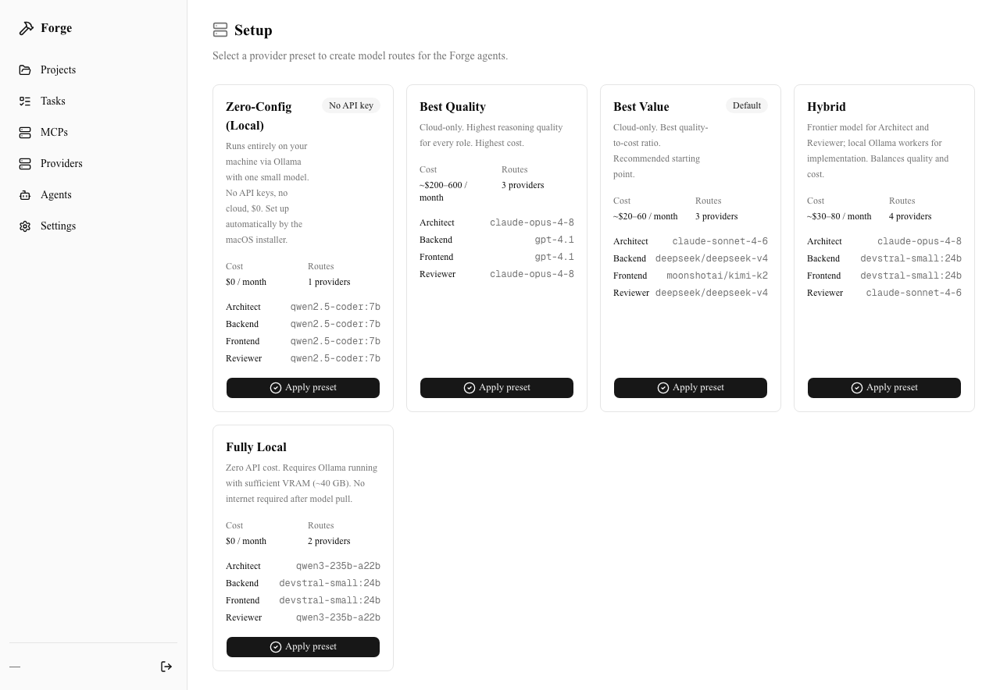
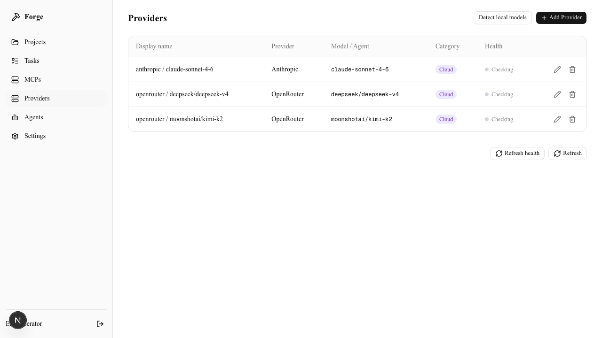
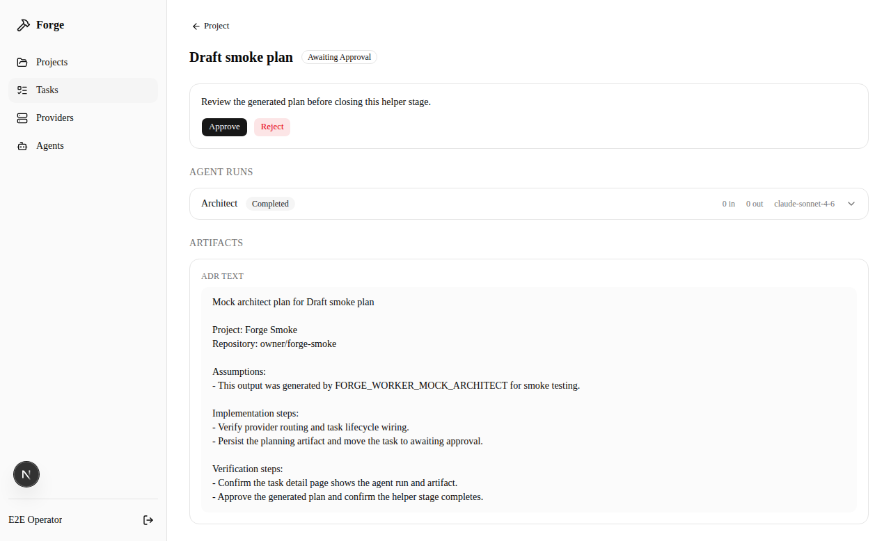
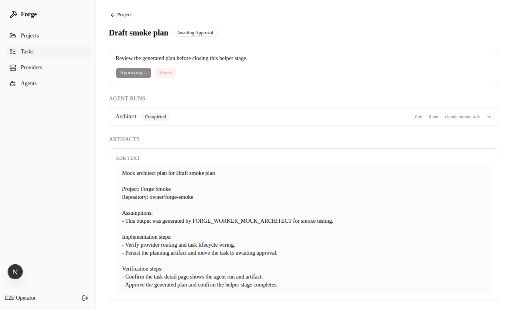

# Forge

Forge is an open-source, self-hosted AI coding orchestration dashboard for
running an AI Orchestrator, coding agents, GitHub workflows, and local or cloud
LLM providers from your browser.

It is built for developers exploring AI tools, autonomous coding agents,
multi-agent software engineering, LLM orchestration, and self-hosted coding
assistants.

Think of it as a control panel:

1. You create a project.
2. You describe a task.
3. Forge sends that task to a configured AI Orchestrator.
4. The Orchestrator streams a Markdown plan shaped for the kind of software requested.
5. You review and approve the result.

Today, Forge handles the first Orchestrator stage: planning. It does not yet
edit your repository, make commits, or open pull requests by itself.

## What Runs On Your Computer

Forge has four main pieces:

- **Web app**: the dashboard you open at `http://localhost:3000`.
- **Worker**: the background loop that picks up tasks and calls AI models.
- **PostgreSQL**: the database that stores settings, users, tasks, and results.
- **Redis**: the queue that passes work from the web app to the worker.

Local installs start the worker inside the web process by default, so `npm run
dev` is enough for the usual single-user setup. You can still split the worker
into its own process with `FORGE_EMBED_WORKER=0` when you want production-style
process isolation.

```text
Browser -> Forge web app -> Redis queue -> Forge worker -> AI Orchestrator -> review in browser
```

## Fastest Setup On macOS Or Linux

From the repository root:

```bash
bash scripts/install.sh
```

The installer:

- installs missing local tools,
- starts PostgreSQL and Redis,
- installs or checks GitHub CLI for repository tooling,
- creates `.env` with generated secrets,
- prepares the database,
- installs web dependencies,
- optionally installs Ollama and a small local AI model,
- records what it installed so uninstall avoids tools you already had.

The first run can be slow because Homebrew, npm, or AI models may need to
download files.

To skip the local Ollama model and configure AI providers later:

```bash
FORGE_SKIP_OLLAMA=1 bash scripts/install.sh
```

To inspect readiness without changing the machine:

```bash
bash scripts/install.sh --check
```

## Start Forge

After install:

```bash
cd web
npm run dev
```

Then open:

```text
http://localhost:3000
```

The web app starts the task worker automatically. To run the worker as a
separate process instead:

```bash
FORGE_EMBED_WORKER=0 npm run dev
```

```bash
cd web
npm run worker
```

The first account creates a password and, by default, a passkey. To skip
passkeys for convenience, set `FORGE_PASSKEYS_ENABLED=0` in `.env` before
creating the first account.

Local projects can be created from the project dialog. Use the folder selector
to choose a parent location; Forge creates a new project folder there and stores
that path for future worker runs.

## Uninstall

The install and uninstall scripts are conservative:

- `scripts/install.sh` creates `.env`, installs missing tools, prepares
  PostgreSQL/Redis, installs `web/node_modules`, optionally configures Ollama,
  and records only packages it added in `.forge/install-manifest`.
- `scripts/uninstall.sh` removes Forge build artifacts and recorded Forge-only
  packages. Packages that existed before Forge are left alone.
- Keeping data preserves `.env`, PostgreSQL/Redis data, and the install manifest
  so a future reinstall can pick up your settings.
- Removing data wipes Forge-local settings, the application database, Redis data,
  recorded Ollama models, and install state.

To remove Forge from macOS or Linux:

```bash
bash scripts/uninstall.sh
```

The script asks whether to keep settings and credentials. Keeping them preserves
`.env`, database data, Redis data, and the install record for a future reinstall.
It also asks whether to delete the local project folders Forge created; answer no
to keep your project files.

Preview first:

```bash
bash scripts/uninstall.sh --dry-run
```

Full local wipe:

```bash
bash scripts/uninstall.sh --remove-data
```

Also delete every local project folder Forge created:

```bash
bash scripts/uninstall.sh --remove-data --remove-projects
```

Detailed install/uninstall reference: [docs/install-uninstall.md](docs/install-uninstall.md).

## Database Updates

After pulling new code, apply database migrations:

```bash
cd web
npm run db:migrate
```

For the migration workflow, see
[docs/database-migrations.md](docs/database-migrations.md).

## Helpful Docs

- [Install/uninstall reference](docs/install-uninstall.md)
- [Database migrations](docs/database-migrations.md)
- [Orchestrator model test guide](docs/orchestrator-model-install-test.md)
- [Deployment checklist](docs/deployment-checklist.md)
- [Worker process notes](docs/worker-process.md)
- [Specialist subagents roadmap](docs/specialist-subagents-roadmap.md)
- [Terminal installer plan](docs/terminal-installer-plan.md)

## Current Status

Forge is in an Orchestrator-stage beta.

Available today:

- local dashboard,
- password sign-in with optional passkeys,
- provider setup,
- GitHub and local-folder project creation,
- queued worker execution,
- live Markdown planning output,
- software-type-aware architect personas with specialist handoffs,
- web research context for architect planning,
- human approval flow.

Not built yet:

- automatic repository edits,
- multi-agent implementation,
- test execution by agents,
- GitHub branch and pull request automation.

## Screenshots

### Setup Wizard



### Provider Review



### Architect Plan Awaiting Approval



### Completed Orchestrator Task


