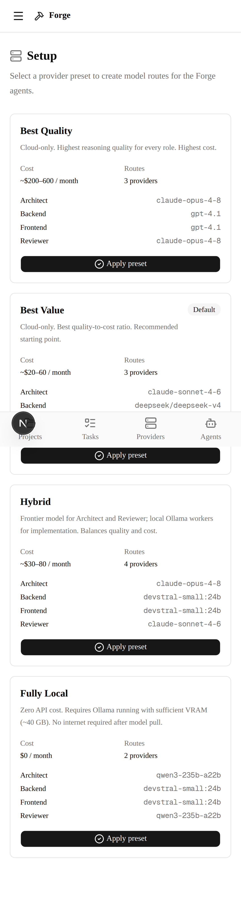
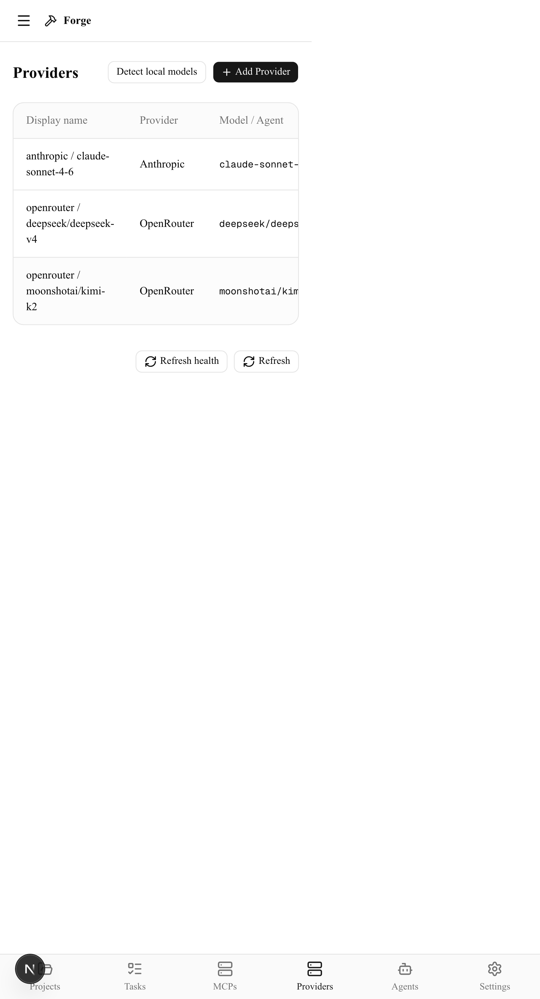
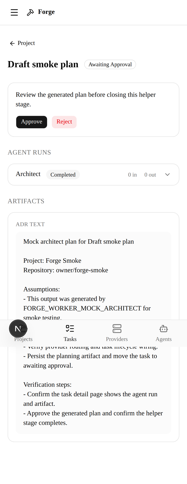
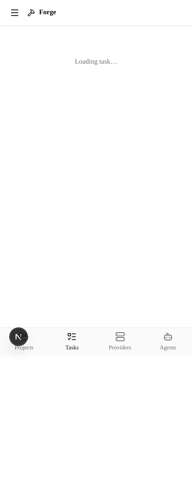

# Forge Orchestrator-Stage UX Audit

Last updated: 2026-06-21

## Scope

This audit covers the Orchestrator-stage beta path:

1. first dashboard visit with no providers,
2. account creation with password and optional passkey,
3. setup wizard preset application,
4. provider health review,
5. project creation,
6. task creation,
7. worker-generated architect artifact,
8. approval and completion.

## Screenshot Evidence

The Playwright smoke test captures full-page screenshots for the key states.
These checked-in copies come from the passing `Web CI` run for commit
`d8c4dad` on 2026-06-19.

| State | Desktop | Mobile |
|---|---|---|
| Setup wizard |  |  |
| Providers after preset |  |  |
| Task awaiting approval |  |  |
| Task completed |  |  |

The CI workflow also uploads fresh copies in the `playwright-artifacts` artifact
from `web/test-results`, along with the HTML report in `web/playwright-report`.

The checked-in screenshots are documentation assets, not the release gate. The
audit remains enforced through CI services, which start PostgreSQL and Redis
before running `npm run e2e`.

## Findings

- The setup wizard is the correct first screen for an unconfigured instance. It
  offers concrete provider presets and avoids sending operators to an empty
  dashboard.
- The auth screens should stay direct and low-friction: first setup creates a
  password and, when enabled, a passkey. Login should show only enabled methods.
- The Providers page is the right post-preset destination because it exposes
  health and missing-key feedback before a task is submitted.
- Project and task creation use direct, focused dialogs with required fields and
  clear submit states.
- The task detail page exposes the current status, agent run, generated
  artifact, and approval action in one place, which matches the Orchestrator-stage
  beta workflow.
- The approval flow has a clear terminal state: after approval, the worker marks
  the Orchestrator-stage task `completed` and the generated artifact remains visible.

## Risks To Recheck After Visual Artifact Review

- Long provider/model labels should be checked at mobile width in the Providers
  and Setup views.
- Mobile bottom-tab navigation should be rechecked from deep scroll positions;
  an early CI trace showed page content intercepting the Projects tab click, so
  the smoke test routes directly to the Projects page.
- The task detail page should be checked with longer architect artifacts to
  ensure review controls remain easy to reach.
- Empty, loading, failed, and degraded-provider states need a second audit pass
  once seeded fixtures cover those states.
