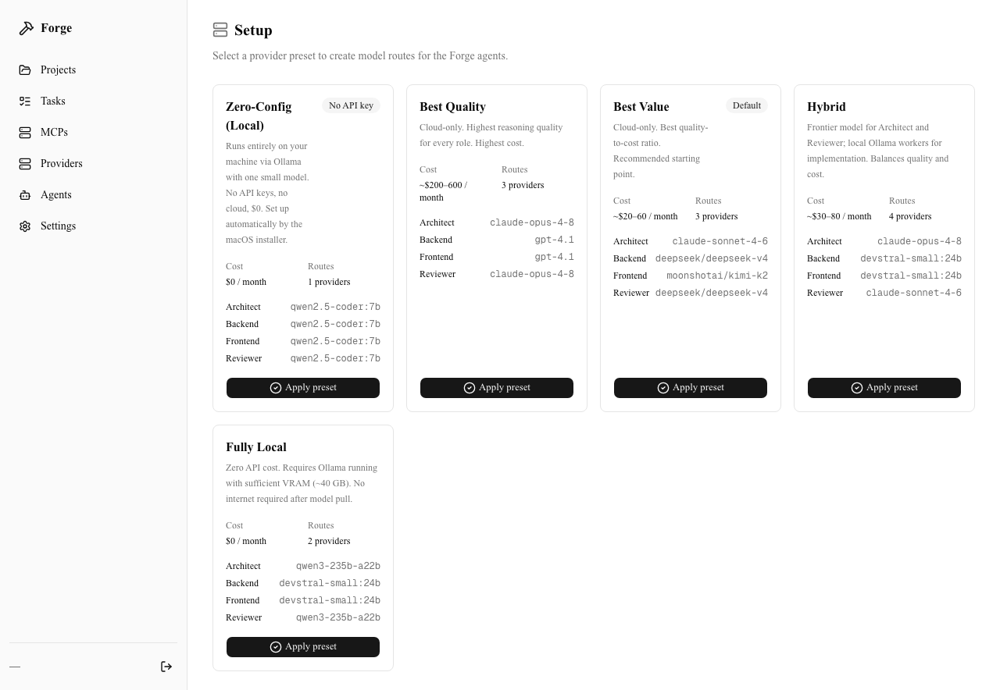
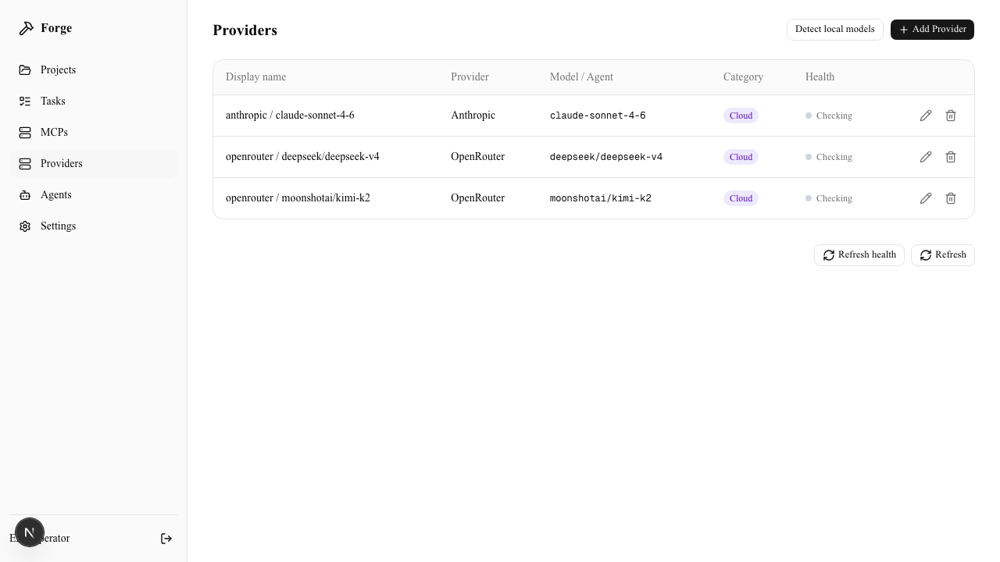
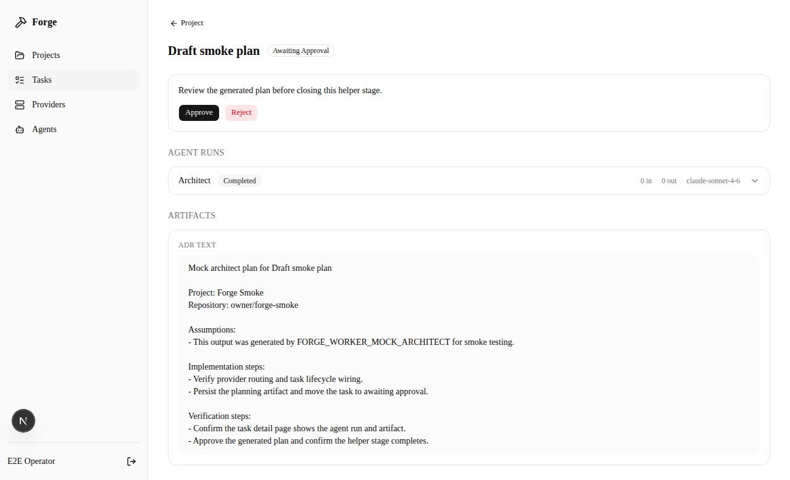
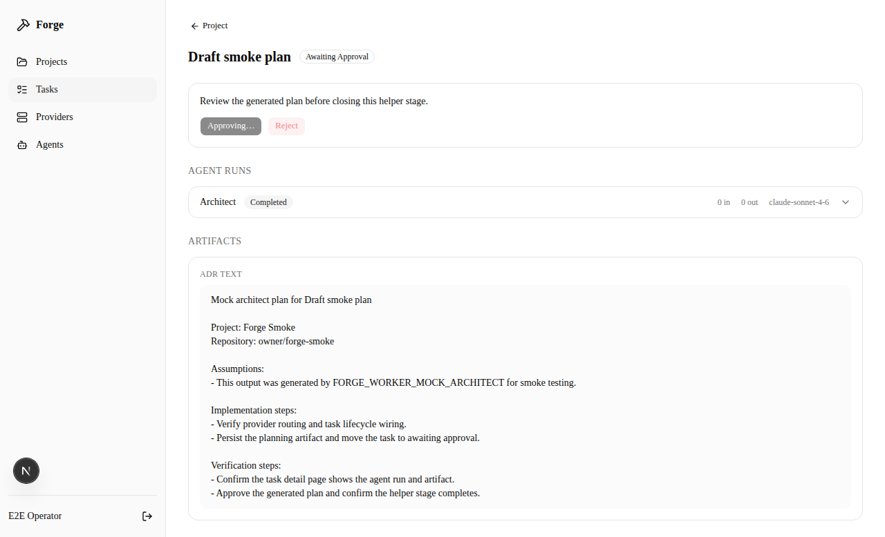

# Forge Wiki

This is the layman-readable Forge overview. It is written so it can be mirrored
into Notion without requiring a reader to know the codebase first.

Last synced from the repository: 2026-09-03.

## What Forge Is

Forge is currently a local control room for AI coding work. You open a browser
dashboard, connect one or more AI providers, choose a repository-backed project,
describe a task, and review the plan Forge produces.

The current beta is deliberately cautious. Forge can plan work, materialize
durable work packages and gates, broker capability/MCP admission, preserve
evidence, and prepare specialist handoff artifacts. Specialist package execution
and file materialization are currently **unavailable** because Forge does not yet
have the required operating-system-enforced confined execution path. Reserved
execution flags do not open that boundary, and direct host-repository writes are
not available.

The accepted longer-term direction is **Forge VNext**: a local-first,
budget-aware, deterministic-first runtime for installable AI Workforces.
Software Engineering becomes the first Workforce rather than the permanent
definition of Forge itself.

The key idea is simple:

```text
Install a Workforce
  -> bind the resources it may use
  -> grant bounded capabilities
  -> give it a Mission
  -> Forge handles deterministic orchestration, budgets, execution policy,
     evidence, verification, recovery, and escalation
```

Models should be temporary workers for bounded reasoning. Scheduling, routing,
budgets, state, retries, recovery, and trigger processing belong in ordinary
software. A healthy persistent Forge responsibility should be able to sit idle
without burning model tokens.

See [Forge VNext architecture](forge-vnext-architecture.md),
[ADR 0014](adr/0014-forge-vnext-general-agent-runtime.md), and the
[product roadmap](roadmap.md) for the accepted future direction.

## What Forge Does Today

Default Orchestrator-stage flow:

```text
You write a task
  -> Forge saves it
  -> Redis wakes the worker
  -> Architect writes a plan
  -> Forge saves the plan
  -> work packages and review gates are materialized
  -> you approve, reject, revise, stop, or recover the work
  -> Forge prepares bounded handoff/evidence state
```

The specialist mutation path remains fail-closed. A current approval does not
mean an agent receives arbitrary filesystem, shell, network, or MCP authority.

Important delivered foundations include:

- unified capability/MCP admission and recovery work under Epic #172;
- deterministic typed Operation Catalog (#201 / ADR 0011);
- canonical execution outcomes (#185 / ADR 0010);
- append-only capability reliability evidence (#186 / ADR 0012);
- verification-goal registry foundations (#187 / ADR 0013).

Those foundations are reused by VNext. Forge should not build a second operation,
reliability, verification, or autonomy truth merely because the product expands
beyond coding.

Task controls cover common operator interventions such as stop, retry, plan
revision, approval/rejection, and recovery of supported blocked states. Agent
history and stored artifacts preserve the evidence instead of relying on a chat
session as durable state.

Still future work includes:

- the OS-enforced generic execution envelope required for specialist writes;
- general branch, commit, PR, merge, or deployment authority;
- parallel specialist mutation with safe resource-concurrency rules;
- autonomous QA/Reviewer/Security execution that can satisfy trusted gates;
- persistent Missions and Trigger/Event scheduling;
- non-repository Workforces such as Deep Research;
- general Resource/Capability adapters;
- the deferred broad Forge Workspace pane system.

## The Simple Analogy

Today, picture a cautious software team:

- you state the outcome;
- an Architect prepares the plan;
- Forge turns that plan into bounded work packages and required capabilities;
- Forge records what was proposed, approved, blocked, or verified;
- risky or unsupported execution stays closed rather than being improvised by a
  model.

VNext generalizes the organisation rather than throwing this away. A Software
Engineering Workforce, a Deep Research Workforce, and an Infrastructure Ops
Workforce can eventually share the same Mission, Resource, Grant, Budget,
Operation, Artifact, and Gate contracts.

The orchestrator itself does not need to be a permanent model. Forge Core owns
the deterministic state and lends narrowly scoped, revocable authority to each
bounded run.

## The Moving Parts

| Part | What it means today |
|---|---|
| Dashboard | The browser app for projects, providers, tasks, approvals, blocked states, and evidence. |
| PostgreSQL | The durable source of orchestration and evidence truth. |
| Redis | Queue/wakeup, retry, and dead-letter transport; not the authoritative task history. |
| Worker | Background process that claims queued tasks and calls configured model providers for supported stages. |
| Provider | A model connection such as a direct API, OpenRouter/LiteLLM, Ollama/LM Studio, or ACP-backed local CLI. |
| Architect | The current planning agent for coding tasks. Under VNext it becomes a Software Engineering Workforce role, not a universal Forge role. |
| Workforce | Editable team/work-package model today; VNext turns this into a versioned installable declarative organisation. |
| Work package | Durable scoped unit of planned specialist work with dependencies, capabilities, inputs, and acceptance criteria. |
| Artifact | Saved plan, output, evidence, finding, report, or log linked to execution history. |
| Operation Catalog | Delivered typed deterministic execution surface used to request approved operations instead of arbitrary commands. |
| Forge VNext | Accepted future runtime architecture built around Missions, Workforces, scoped Grants, budgets, deterministic orchestration, and evidence. |
| Forge Workspace | Deferred future interface proposal for dockable browser/repo/docs/tool panes and linked context. |

## Screenshots

These screenshots are checked into the repository under `docs/assets/gui/`.
When this page is mirrored into Notion, use raw GitHub image URLs or uploaded
Notion images instead of the repo-relative paths below.









Mobile screenshots are also available:

- `docs/assets/gui/mobile-01-setup.png`
- `docs/assets/gui/mobile-02-providers.png`
- `docs/assets/gui/mobile-03-task-awaiting-approval.png`
- `docs/assets/gui/mobile-04-completed.png`

If a screenshot and the live app disagree, the live repository/app wins. The
screenshots are illustrative evidence, not capability contracts.

## Provider Options

Forge supports several kinds of model connections:

| Option | Best for | Plain-English note |
|---|---|---|
| Direct cloud providers | Configured provider API access | Forge talks directly to a supported provider endpoint. |
| OpenRouter | Trying hosted model families behind one gateway | One key can reach multiple providers/models. |
| LiteLLM | Self-controlled routing/gateway setups | A separate gateway presents configured models behind one API shape. |
| Ollama / LM Studio | Local models | Useful for local/no-key experiments and privacy-sensitive work where capable enough. |
| ACP | Local coding CLIs | Forge starts a local adapter that talks to tools such as Codex CLI or Claude Code. |

VNext adds a provider-neutral cognitive-class and budget layer above those
connections. A Workforce should request something like economy/standard/frontier
requirements rather than permanently binding its identity to a vendor model.
Routing remains deterministic software; Forge should not spend an LLM call just
to decide which LLM to call.

## ACP And Zed, In Simple Terms

ACP stands for Agent Client Protocol. It is a common way for one program to talk
to a coding agent.

Forge's ACP path is conceptually:

```text
Forge
  -> starts a pinned local ACP adapter
  -> adapter speaks ACP over JSON-RPC
  -> adapter wraps a real local CLI such as codex or claude
  -> the CLI uses the account already logged in on the machine
  -> text streams back into Forge
```

ACP can support provider calls such as Architect planning. It does **not** turn
path validation into OS confinement, grant broad host authority, or override the
current fail-closed specialist execution boundary.

You do not need the Zed editor installed for this path. "Zed connector" refers
to the adapter package used as a translator. The adapter is intentionally kept
away from broad Forge provider/database/Redis/GitHub/encryption secrets where the
runtime contract permits.

For more detail, see [ACP And The Zed Connector](acp-zed-connector.md).

## Forge VNext, In Simple Terms

VNext separates the durable mission from individual model calls.

A future **Mission** is a durable outcome or responsibility. An **Execution** is
one bounded attempt or cycle. A **Resource** is the thing Forge may read or
affect. A **Capability** is a class of action. A **Grant** combines capability,
resource scope, Principal, constraints, and policy.

That lets Forge express work such as:

```text
Software Engineering Mission
  -> repository Resource
  -> filesystem/Git/GitHub capabilities

Deep Research Mission
  -> web/document Resources
  -> search/read/evidence capabilities

Infrastructure Ops Mission
  -> service Resources
  -> health/read/restart capabilities
```

An installed Workforce may request capabilities, but installation itself does
not grant authority or connector credentials. Package-defined gates may add
restrictions but cannot weaken mandatory Forge/operator security ceilings.

Three reference Workforces prove the architecture in order:

1. **Software Engineering** — safe mutation and deterministic verification.
2. **Deep Research** — non-repository reasoning and evidence provenance.
3. **Infrastructure Ops** — persistent event-driven work with zero-token idle
   periods and bounded reversible side effects.

Only after those proofs does HearthBot cut over fully to Forge and Hermes retire.
Useful Hermes/HearthBot lessons are re-derived as Forge-native requirements;
Hermes code, state, config, parent-agent prompts, and routing implementation are
not imported.

Model ensembles are deliberately outside this programme for now.

## Forge Workspace, Deferred

Forge Workspace remains a useful future interface idea: dockable panes for a
human browser, separate Playwright browser, repo/docs, notes, diffs, terminal and
logs, GitHub/Notion links, and task evidence.

It is **not** the next architectural priority. Broad Workspace expansion is
deferred until the VNext runtime contracts and core reference-Workforce proofs
are stable enough to justify the extra surface area.

The historical design proposal remains in
[Forge Workspace roadmap](workspace-roadmap.md). Its old sequencing is explicitly
superseded by VNext.

## How To Start Locally

From the repository root:

```bash
bash scripts/install.sh
forge
```

Open:

```text
http://localhost:3000
```

The installer prepares local services, creates
`~/Documents/Forge/config/forge.env`, installs dependencies, runs migrations,
and can optionally set up a small local Ollama path.

## What To Read Next

- [Forge VNext architecture](forge-vnext-architecture.md) for the accepted
  general-agent architecture and invariants.
- [Product roadmap](roadmap.md) for the canonical VNext product direction.
- [Near-term roadmap](near-term-roadmap.md) for exact implementation order and
  release gates.
- [Operator guide](operator-guide.md) for install, startup, health checks,
  deployment, and uninstall.
- [Developer guide](developer-guide.md) for code structure, worker flow,
  database tables, prompts, and tests.
- [ACP And The Zed Connector](acp-zed-connector.md) for local ACP provider
  behavior.
- [Forge Workspace roadmap](workspace-roadmap.md) for the deferred historical
  interface proposal.
- [Design guide](design.md) for UI principles and screenshot evidence.
